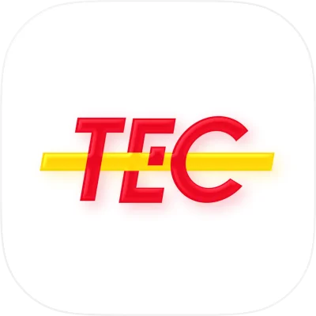
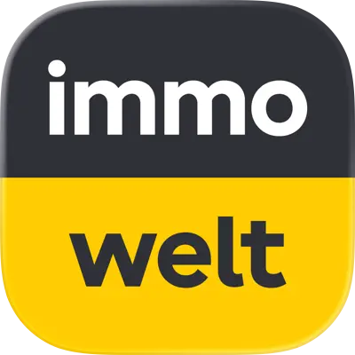
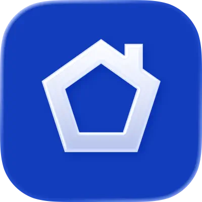

# Hi, I'm Raphael 👋

> iOS Engineer with 10 years of experience.

Currently at **Immoweb**. Previously at **M6Web**, **Bedrock Streaming**, and **SeLoger**.

## Focus

- iOS product engineering
- AI agentic coding
- Developer tooling
- Homelab / self-hosted systems
- Media server infrastructure

## Professional Work

### iOS apps

<table>
  <thead>
    <tr>
      <th align="left" width="12%">Name</th>
      <th align="left" width="41%">Description</th>
      <th align="left" width="22%">Company</th>
      <th align="left" width="15%">Date</th>
      <th align="center" width="10%">App Store</th>
    </tr>
  </thead>
  <tbody>
    <tr>
      <td><a href="https://apps.apple.com/fr/app/m6-streaming-tv-replay/id369692259">M6+</a></td>
      <td>France's leading free streaming platform for live TV, replay, podcasts, and exclusive originals.</td>
      <td> </td>
      <td nowrap><code>2017-2020</code></td>
      <td align="center"></td>
    </tr>
    <tr>
      <td><a href="https://apps.apple.com/us/app/rtl-play-streaming-et-direct/id500999908">RTL Play</a></td>
      <td>RTL Belgium's streaming hub for live channels, replay, films, series, news, and sport.</td>
      <td> </td>
      <td nowrap><code>2020-2022</code></td>
      <td align="center"></td>
    </tr>
    <tr>
      <td><a href="https://apps.apple.com/be/app/tec/id1438618535">TEC</a></td>
      <td>Wallonia's transit companion for route planning, real-time journeys, and mobile ticketing.</td>
      <td></td>
      <td nowrap><code>2017-2022</code></td>
      <td align="center"></td>
    </tr>
    <tr>
      <td><a href="https://apps.apple.com/de/app/immowelt-immobilien-suche/id354119842">immowelt</a></td>
      <td>Award-winning property platform for renting, buying, and listing homes across Germany and Austria.</td>
      <td></td>
      <td nowrap><code>2022-2025</code></td>
      <td align="center"></td>
    </tr>
    <tr>
      <td><a href="https://apps.apple.com/fr/app/seloger-location-achat-immo/id326883014">SeLoger</a></td>
      <td>One of France's landmark real estate apps for searching, renting, buying, and valuing property.</td>
      <td></td>
      <td nowrap><code>2022-2025</code></td>
      <td align="center"></td>
    </tr>
    <tr>
      <td><a href="https://apps.apple.com/us/app/immoweb/id420654412">Immoweb</a></td>
      <td>Belgium's leading real estate platform for buying, selling, and renting homes at scale.</td>
      <td></td>
      <td nowrap><code>2025-Now</code></td>
      <td align="center"></td>
    </tr>
  </tbody>
</table>

## Connect

