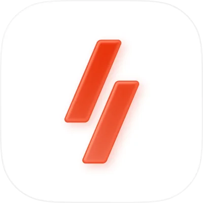

# Hi, I'm Raphael 👋

iOS engineer with 10 years of experience building Apple platform apps.  
Built apps used by millions of people, working on interface design and product development at scale.

Now focused on open source, exploring agentic coding workflows and building things.

## Things I'm Building

- [CodexPill](https://github.com/raphhgg/CodexPill) — macOS menubar app for switching Codex accounts and tracking per-account limits
- [Seal](https://github.com/raphhgg/Seal) — proof-oriented validation ecosystem for Apple apps
- [Kite](https://github.com/raphhgg/kite) — Swift-first code metrics CLI for maintainability review and agent workflows
- [Maestro](https://github.com/raphhgg/Maestro) — macOS app for configuring, running, and observing agent workflows
- [heimdall](https://github.com/raphhgg/heimdall) — backend for self-hosted media request flows and notifications

## Home Server

- [homelab](https://github.com/raphhgg/homelab) — self-hosted home server Docker Compose stack
- [homelab-infra](https://github.com/raphhgg/homelab-infra) — infra docs and helper scripts for Proxmox, Zabbix, TrueNAS and homelab things
- [kometa-config](https://github.com/raphhgg/kometa-config) — Kometa config for collections, metadata and overlays

## Config & Tools

- [dotfiles](https://github.com/raphhgg/dotfiles) — personal dotfiles managed with GNU Stow
- [llama-config](https://github.com/raphhgg/llama-config) — llama.cpp presets, launch scripts and benchmark tooling for the local LLM setup I run

## Professional Apps

Some of the products I’ve worked on professionally:

<table>
  <thead>
    <tr>
      <th align="left" width="12%">Name</th>
      <th align="left" width="41%">Description</th>
      <th align="center" width="7%">Platforms</th>
      <th align="left" width="19%">Company</th>
      <th align="left" width="15%">Date</th>
      <th align="center" width="6%">App Store</th>
    </tr>
  </thead>
  <tbody>
    <tr>
      <td><a href="https://apps.apple.com/us/app/immoweb/id420654412">Immoweb</a></td>
      <td>Belgium's leading real estate platform for buying, selling, and renting homes at scale.</td>
      <td align="center"> </td>
      <td> </td>
      <td nowrap>2022-Now</td>
      <td align="center"></td>
    </tr>
    <tr>
      <td><a href="https://apps.apple.com/fr/app/seloger-location-achat-immo/id326883014">SeLoger</a></td>
      <td>One of France's landmark real estate apps for searching, renting, buying, and valuing property.</td>
      <td align="center"> </td>
      <td></td>
      <td nowrap>2022-2025</td>
      <td align="center"></td>
    </tr>
    <tr>
      <td><a href="https://apps.apple.com/de/app/immowelt-immobilien-suche/id354119842">immowelt</a></td>
      <td>Award-winning property platform for renting, buying, and listing homes across Germany and Austria.</td>
      <td align="center"> </td>
      <td></td>
      <td nowrap>2022-2025</td>
      <td align="center"></td>
    </tr>
    <tr>
      <td><a href="https://apps.apple.com/be/app/winamp/id1664497725">Winamp</a></td>
      <td>The new Winamp player brings local music, podcasts, radio stations, and fan content into one listening experience.</td>
      <td align="center"> </td>
      <td></td>
      <td nowrap>2021-2021</td>
      <td align="center"></td>
    </tr>
    <tr>
      <td><a href="https://apps.apple.com/be/app/tec/id1438618535">TEC</a></td>
      <td>Wallonia's transit companion for route planning, real-time journeys, and mobile ticketing.</td>
      <td align="center"> </td>
      <td></td>
      <td nowrap>2021-2021</td>
      <td align="center"></td>
    </tr>
    <tr>
      <td><a href="https://apps.apple.com/us/app/rtl-play-streaming-et-direct/id500999908">RTL Play</a></td>
      <td>RTL Belgium's streaming hub for live channels, replay, films, series, news, and sport.</td>
      <td align="center"> &nbsp;&nbsp;</td>
      <td> </td>
      <td nowrap>2020-2022</td>
      <td align="center"></td>
    </tr>
    <tr>
      <td><a href="https://apps.apple.com/fr/app/m6-streaming-tv-replay/id369692259">M6+</a></td>
      <td>France's leading free streaming platform for live TV, replay, podcasts, and exclusive originals.</td>
      <td align="center"> &nbsp;&nbsp;</td>
      <td> </td>
      <td nowrap>2017-2022</td>
      <td align="center"></td>
    </tr>
  </tbody>
</table>

## Connect

